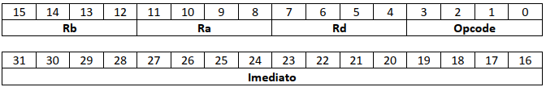
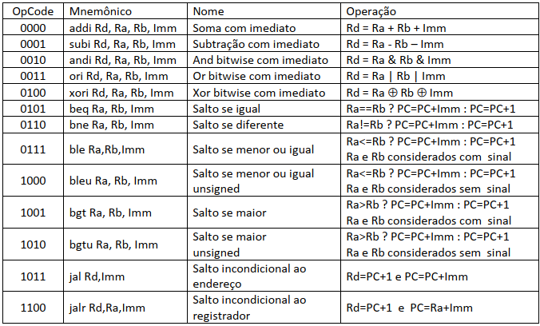

# Projeto Final (LCL - 2021.1): ZeptoProcessador-III de 16 bits
Projeto final de Laboratório de Circuitos Lógicos (LCL), disciplina ofertada na Universidade de Brasília (UnB) no semestre 2021.1. É implementado um processador de 16 bits no software de simulação de circuitos Deeds.

## Funcionamento do processador

Um processador é um circuito capaz de executar instruções básicas com dados de entrada. O ZeptoProcessador-III tem por função executar 13 operações básicas, com os dados sendo guardados em registradores. O processador utiliza também a memória ROM para guardar as instruções a ser executadas.

As instruções recebidas pelo processador são compostas de 32 bits, que se dividem em trechos de: Opcode (código da operação a ser realizada); Ra e Rb (os registradores que estão envolvidos na operação); Rd (registrador onde será guardado o resultado da operação); e Imm (valor imediato em bits que entra na operação).

A estrutura da instrução pode ser vista abaixo.

A tabela de operações realizadas pelo processador também pode ser vista na figura abaixo.

## Implementação do processador

Para implementar o processador, foram utilizados alguns componentes principais: o registrador PC, que armazena o endereço da instrução a ser executada; a memória de instruções, que guarda as instruções para executar; o banco de registradores (composto de 16 registradores de 16 bits), onde são guardadas as informações nos registradores.

Há também as ULAs, que implementam as operações aritméticas; o comparador, que compara valores; MUX que interligam o circuito; o bloco de controle, que define as entradas dos componentes do circuito; e os sinais de monitoramento, visores que exibem os bits do registrador PC, das instruções sendo executadas e dos registradores em uso.

No Deeds, o banco de registradores, o bloco de controle, o comparador e o registrador PC foram feitos em blocos separados, depois integrados ao circuito maior que abarca todo o projeto.

## Programas implementados

Para testar e exemplificar o que é possível fazer utilizando o ZeptoProcessador-III, foram elaborados 5 programas que fazem operações aritméticas a partir das operações básicas implementadas pelo processador.

Esses programas definem multiplicação sem sinal e com sinal, divisão sem sinal e com sinal, e obtenção de resto de divisão sem sinal. Na pasta Arquivos de memória é possível encontrar os arquivos .drs que devem ser carregados nas memórias ROM para executar esses programas.

Já estão montadas nos arquivos .drs as operações de: 6x4 (sem sinal); 6x4, 6x-4, -6x4 e -6x-4 (com sinal); 9/2 (sem sinal); 9/2, 9/-2, -9/2, -9/-2 (com sinal); e 17%3 (sem sinal).

## Relatório detalhado

O relatório detalhado explicando cada parte da implementação do processador, bem como da elaboração dos programas feitos, pode ser visto no arquivo Projeto_G46.pdf.

## License
[MIT](https://choosealicense.com/licenses/mit/)
